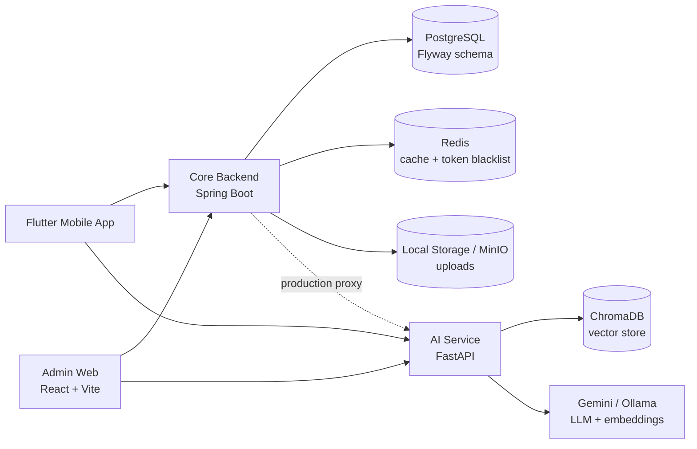

# 🎓 EdLearn: AI-powered Learning Platform

> A multi-platform EdTech system for LMS, exam practice, admin operations, and AI-assisted learning with RAG, spaced repetition, and modular backend architecture.

[](https://openjdk.org/)
[](https://spring.io/projects/spring-boot)
[](https://fastapi.tiangolo.com/)
[](https://react.dev/)
[](https://flutter.dev/)
[](https://postgresql.org/)
[](https://redis.io/)
[](https://docker.com/)

## Overview

EdLearn is a monorepo for a full learning platform: a Spring Boot core backend, a FastAPI AI service, a React admin web app, and a Flutter mobile app. It targets active learning workflows such as course enrollment, lesson progress, mock exams, error-bank review, badges, streaks, and AI-assisted question solving.

The system combines classic LMS capabilities with technical learning support: Flyway-managed PostgreSQL schema, Redis-backed security/cache infrastructure, MinIO-ready file storage, ChromaDB vector search, and AI providers behind a configurable abstraction. The core backend is designed as a modular monolith using Clean Architecture and DDD-style bounded contexts.

> [!NOTE]
> The most detailed backend documentation lives in [core-backend/README.md](./core-backend/README.md). The AI service has its own setup notes in [ai-service/README.md](./ai-service/README.md).

## System Architecture



Primary request flow:

1. Student and admin clients call the Spring Boot API for identity, LMS, exams, progress, and content management.
2. AI workflows call the FastAPI service for lesson ingestion, RAG chat, exam PDF extraction, and image solving.
3. PostgreSQL stores durable product data; Redis supports cache/security concerns; ChromaDB stores vector embeddings for retrieval.

## Key Features

- **Identity & Security:** JWT authentication, refresh tokens, logout, Redis token blacklist, role-based access control, and current-user profile APIs.
- **LMS Core:** Course, chapter, lesson, enrollment, preview lesson, progress tracking, uploads, and student workspace flows.
- **Assessment:** Exam library, THPT-oriented question structure, question options, attempts, answer submission, review, statistics, and image-supported questions.
- **Spaced Repetition:** Error-bank and lesson-content review data with SM-2-style fields including `ease_factor`, `interval_days`, and `next_review_date`.
- **Gamification:** User streak tracking, badge catalog, and user badge ownership.
- **AI Learning:** RAG lesson ingestion, contextual chat, PDF exam extraction, provider abstraction for Gemini/Ollama, and ChromaDB-backed retrieval.
- **Admin Operations:** React admin UI for courses, lessons, exams, attempts, users, badges, error bank, AI solver, and dashboard views.
- **Mobile Learning:** Flutter app for authentication, home dashboard, learning flows, mock exams, camera checks, results, assessment onboarding, and self-study screens.

## Repository Structure

```text
EdLearn/
├── core-backend/              # Spring Boot core API: Identity, LMS, Exams, Badges
├── ai-service/                # FastAPI AI service: RAG, chat, PDF extraction, solver
├── admin_web/                 # React + Vite admin dashboard
├── mobile_app/                # Flutter student mobile app
├── docs/                      # Deployment notes and generated DBML/ERD support files
├── examai_plantuml_diagrams/  # Use case, activity, sequence, and class diagrams
├── deploy/                    # Deployment configs such as nginx
├── docker-compose.yml         # Local infrastructure: PostgreSQL, Redis, MinIO, ChromaDB
└── README.md
```

### Service Responsibilities

| Service        | Stack                             | Responsibility                                                               | Local URL               |
| -------------- | --------------------------------- | ---------------------------------------------------------------------------- | ----------------------- |
| `core-backend` | Java 17, Spring Boot, JPA, Flyway | Product API, auth, LMS, exams, badges, storage integration                   | `http://localhost:8080` |
| `ai-service`   | Python, FastAPI, ChromaDB client  | RAG ingestion/chat, exam extraction, image solving, LLM provider integration | `http://localhost:8001` |
| `admin_web`    | React 19, Vite, React Router      | Admin dashboard for content and operational management                       | `http://localhost:5173` |
| `mobile_app`   | Flutter, Dart                     | Student-facing learning, exams, assessment, and study flows                  | Device/emulator         |
| Infrastructure | Docker Compose                    | PostgreSQL, Redis, MinIO, ChromaDB                                           | Multiple ports          |

## Getting Started

### Prerequisites

- Docker and Docker Compose
- Java 17
- Node.js 20+ and npm
- Python 3.10+
- Flutter SDK with Dart 3.x
- Optional: Gemini API key or local Ollama setup for AI workflows

### 1. Start Infrastructure

From the repository root:

```bash
docker-compose up -d
```

This starts:

| Service       | Port   | Default Credentials / Notes                             |
| ------------- | ------ | ------------------------------------------------------- |
| PostgreSQL    | `5432` | database `edlearn_db`, user `edlearn`, password `12345` |
| Redis         | `6379` | default local Redis                                     |
| MinIO API     | `9000` | `minioadmin` / `minioadmin`                             |
| MinIO Console | `9001` | browser console                                         |
| ChromaDB      | `8000` | vector database for AI service                          |

### 2. Run Core Backend

```bash
cp core-backend/.env.example core-backend/.env
cd core-backend
./mvnw spring-boot:run
```

Core backend URLs:

- Swagger UI: `http://localhost:8080/swagger-ui/index.html`
- OpenAPI JSON: `http://localhost:8080/v3/api-docs`

### 3. Run AI Service

```bash
cd ai-service
python -m venv .venv
source .venv/bin/activate
pip install -r requirements.txt
cp .env.example .env
uvicorn app.main:app --reload --port 8001
```

AI service URLs:

- Swagger UI: `http://localhost:8001/docs`
- OpenAPI JSON: `http://localhost:8001/openapi.json`

> [!IMPORTANT]
> If `AI_PROVIDER=gemini`, set `GEMINI_API_KEY` in `ai-service/.env`. If using Ollama, switch `AI_PROVIDER=ollama` and ensure the configured local models are available.

### 4. Run Admin Web

```bash
cd admin_web
cp .env.example .env
npm install
npm run dev
```

For local backend development, set:

```dotenv
VITE_API_BASE_URL=http://localhost:8080/api/v1
```

### 5. Run Mobile App

```bash
cd mobile_app
flutter pub get
flutter run
```

Check `mobile_app/lib/core/network/api_config.dart` when switching between emulator, simulator, physical device, and deployed API environments.

## API Documentation

| Service                    | Documentation                                                                                  |
| -------------------------- | ---------------------------------------------------------------------------------------------- |
| Core Backend Local Swagger | `http://localhost:8080/swagger-ui/index.html`                                                  |
| Core Backend Live Swagger  | [https://api.phuocanh.me/swagger-ui/index.html](https://api.phuocanh.me/swagger-ui/index.html) |
| AI Service Local Swagger   | `http://localhost:8001/docs`                                                                   |
| Admin Web Deployment Notes | [docs/admin_web_deployment.md](./docs/admin_web_deployment.md)                                 |
| Mobile Mock Exam API Notes | [docs/mobile_mock_exam_api.md](./docs/mobile_mock_exam_api.md)                                 |

Core backend API groups include:

| Area        | Example Endpoint                                    | Purpose                  |
| ----------- | --------------------------------------------------- | ------------------------ |
| Auth        | `POST /api/v1/auth/login`                           | Login and token issuance |
| Courses     | `GET /api/v1/courses`                               | Course catalog           |
| Learning    | `POST /api/v1/learning/lessons/{lessonId}/complete` | Lesson completion        |
| Error Bank  | `GET /api/v1/learning/error-bank/due`               | Due review cards         |
| Exams       | `POST /api/v1/exams/{examId}/attempts`              | Start mock exam attempt  |
| Admin Exams | `POST /api/v1/admin/exams`                          | Exam management          |
| Badges      | `GET /api/v1/user-badges/me`                        | Current user's badges    |

AI service API groups include:

| Endpoint                          | Purpose                                                                  |
| --------------------------------- | ------------------------------------------------------------------------ |
| `POST /api/v1/ingest/lesson`      | Chunk lesson content, embed it, and persist vectors in ChromaDB          |
| `POST /api/v1/chat`               | Ask contextual questions using RAG                                       |
| `POST /api/v1/exams/extract-pdf`  | Extract structured exam questions from uploaded PDFs                     |
| `POST /api/v1/solver/solve-image` | Solve one cropped homework question image and return a structured answer |

## Database Schema

The core backend uses PostgreSQL with Flyway migrations in:

```text
core-backend/src/main/resources/db/migration
```

Available schema artifacts:

- ERD image: [core-backend/docs/database-erd.png](./core-backend/docs/database-erd.png)
- dbdiagram.io DBML: [docs/core-backend-dbdiagram.dbml](./docs/core-backend-dbdiagram.dbml)

> [!NOTE]
> Schema generation through Hibernate is disabled. Add or modify tables through Flyway migrations, then update DBML/ERD artifacts when needed.

## Documentation & Diagrams

| Artifact              | Location                                                                         |
| --------------------- | -------------------------------------------------------------------------------- |
| Core backend README   | [core-backend/README.md](./core-backend/README.md)                               |
| AI service README     | [ai-service/README.md](./ai-service/README.md)                                   |
| Admin web deployment  | [docs/admin_web_deployment.md](./docs/admin_web_deployment.md)                   |
| PlantUML diagrams     | [examai_plantuml_diagrams/](./examai_plantuml_diagrams/)                         |
| Clean code guidelines | [core-backend/clean-code-guidelines.md](./core-backend/clean-code-guidelines.md) |

## Useful Commands

```bash
# Start local infrastructure
docker-compose up -d

# Stop local infrastructure
docker-compose down

# Core backend tests
cd core-backend && ./mvnw test

# Admin web build
cd admin_web && npm run build

# AI service run
cd ai-service && uvicorn app.main:app --reload --port 8001

# Mobile app checks
cd mobile_app && flutter analyze
```

## Team

| Member         | Role                         |
| -------------- | ---------------------------- |
| Trần Phước Anh | Backend Developer, DevOps    |
| Mai Phương Nam | AI Engineer, Database Design |
| Phan Văn Nghĩa | Mobile Developer             |

Supervisor: `PhD. Nguyễn Quang Vũ`

## License

Distributed under the MIT License. See `LICENSE` for details when the license file is available in the repository.
