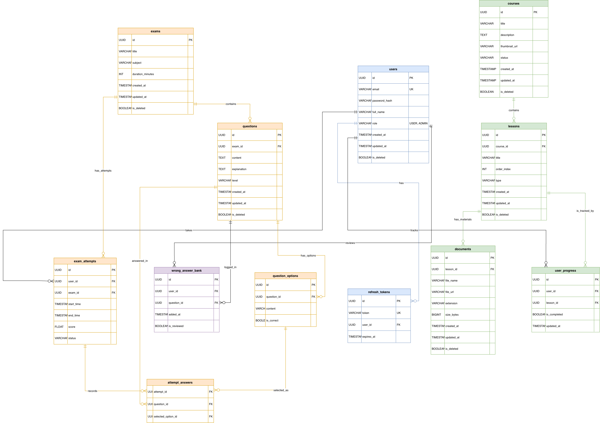

# 🎓 EdLearn - Learning Management System (LMS) API

[](https://www.oracle.com/java/)
[](https://spring.io/projects/spring-boot)
[](https://www.postgresql.org/)
[](https://www.docker.com/)
[](#)

A robust, scalable RESTful API for a Learning Management System (LMS) built with **Java Spring Boot**. It provides comprehensive features for course management, student enrollment, lesson tracking, and real-time statistics.

## 🌟 Live API Documentation (Swagger / OpenAPI)
> **🚀 Try the Live API here:** [https://api.phuocanh.me/swagger-ui/index.html](https://api.phuocanh.me/swagger-ui/index.html)

*(Note: The API is actively deployed. You can view all endpoints, request/response schemas, and test the API directly using the Authorize feature).*

---

## ✨ Key Features
Based on the current implementation, the system supports:
* **🔐 Authentication & Authorization:** JWT-based login, register, token refresh, and logout. Role-based access control (Admin, Instructor, Student).
* **📚 Course Management:** Complete CRUD operations for courses and chapters.
* **📖 Lesson Management:** Upload media (videos/documents) and manage lesson content. Supports **Preview/Enrolled** access logic.
* **🧑‍🎓 Student Workspace:** Course enrollment, progress tracking, and viewing personal learning workspaces.
* **🔥 User Streak:** Gamification feature to track consecutive daily learning activities.
* **📊 Statistics & Dashboard:** Aggregated data for top courses, monthly enrollments, and system summaries.

---

## 🛠️ Tech Stack & Technical Highlights
* **Language & Framework:** Java 17, Spring Boot 3.2
* **Security:** Spring Security, JSON Web Token (JWT)
* **Database & ORM:** PostgreSQL, Spring Data JPA, Hibernate
* **Cache & Message:** Redis
* **Documentation:** SpringDoc OpenAPI 3 (Swagger)
* **DevOps & Deployment:** Docker, GitHub Actions (CI/CD Pipeline)

**💡 Technical Achievements in this project:**
1.  **Clean Architecture:** Strictly followed Clean Architecture principles (Domain, Application, Infrastructure, Presentation layers) to decouple business logic from framework dependencies.
2.  **Performance Optimization:** Resolved the **N+1 Query Problem** inherently found in JPA by actively using `JOIN FETCH` and Entity Graphs for complex queries (e.g., loading Course -> Chapters -> Lessons).
3.  **Containerization:** Automated deployment workflows using Docker and GitHub Actions.

---

## 🏗️ System Architecture
```text
ed-learn-backend
 ┣ 📂 src/main/java/com/vku/edtech
 ┃ ┣ 📂 modules
 ┃ ┃ ┣ 📂 identity                  # Bounded Context: Authentication & User
 ┃ ┃ ┃ ┣ 📂 application             # Use cases, DTOs, Input/Output Ports
 ┃ ┃ ┃ ┣ 📂 domain                  # Core Entities, Exceptions, Domain Services
 ┃ ┃ ┃ ┣ 📂 infrastructure          # JPA Repositories, Spring Security, JWT
 ┃ ┃ ┃ ┗ 📂 presentation            # REST Controllers
 ┃ ┃ ┗ 📂 lms                       # Bounded Context: Courses, Chapters, Lessons
 ┃ ┃ ┃ ┣ 📂 application
 ┃ ┃ ┃ ┣ 📂 domain
 ┃ ┃ ┃ ┣ 📂 infrastructure
 ┃ ┃ ┃ ┗ 📂 presentation
 ┃ ┣ 📂 shared                      # Cross-cutting concerns (Global Exception, Configs)
 ┃ ┗ 📜 CoreBackendApplication.java # Spring Boot Main Class
 ┣ 📜 Dockerfile                    # Docker configuration for containerization
 ┗ 📜 pom.xml                       # Maven dependencies
```

The project is structured into 4 main layers within each module (Bounded Context):
* `Domain`: Enterprise logic, Entities, and Interfaces. (No Spring dependencies).
* `Application`: Use cases, Ports (Input/Output), and business rules.
* `Infrastructure`: Database adapters (JPA Repositories), external services, and security configurations.
* `Presentation`: REST Controllers handling HTTP requests and responses.

---

## 🗄️ Database Schema (ERD)


The system uses **PostgreSQL** for durable storage and **Redis** for caching and session management.

---

## 🚀 Getting Started (Run Locally)

### Prerequisites
* Docker & Docker Compose installed on your machine.
* Java 17 & Maven installed.

### Installation Steps
1. Clone the repository:
   ```bash
   git clone https://github.com/tanh11704/ed-learn.git
   cd ed-learn
   ```

2. Run the supporting services (PostgreSQL, Redis):
   ```bash
   docker-compose up -d
   ```

3. Run the Spring Boot application:
   ```bash
   cd core-backend
   ./mvnw spring-boot:run
   ```

4. Access the API locally:
   * Swagger UI: `http://localhost:8080/swagger-ui/index.html`

---

Developed by **Tran Phuoc Anh**
