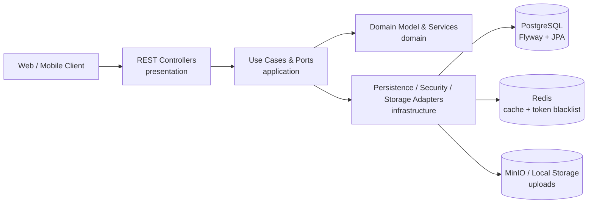
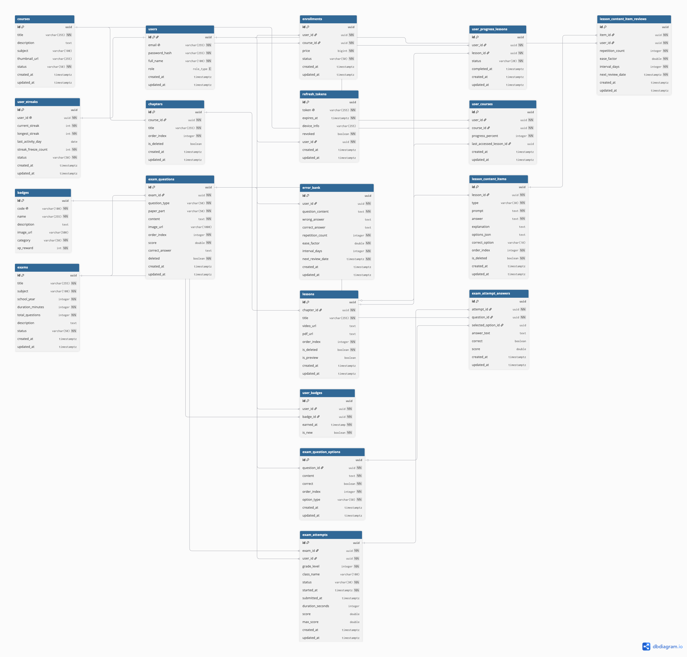

# 🎓 EdLearn: AI-powered Learning Management System

> A modular monolith backend for LMS, assessment, gamification, and spaced-repetition learning, built with Clean Architecture and Domain-Driven Design boundaries.

[](https://openjdk.org/)
[](https://spring.io/projects/spring-boot)
[](https://postgresql.org/)
[](https://redis.io/)
[](https://flywaydb.org/)
[](https://docker.com/)
[](#-project-structure)

## Overview

EdLearn Core Backend is the central API layer for a learning platform that combines course delivery, exam practice, progress tracking, badges, streaks, and AI-assisted study workflows. The codebase is organized as a modular monolith: each business capability owns its domain model, use cases, persistence adapters, and REST API surface while sharing cross-cutting infrastructure through `shared`.

The key technical focus is maintainability under a growing LMS domain. Identity, LMS, Exams, and Badges are separated as bounded contexts; database changes are versioned with Flyway; learning reinforcement uses SM-2-style review metadata for error-bank and lesson-content reviews; and exam scoring is implemented behind strategy-based domain services for THPT-oriented question types.

> [!NOTE]
> This repository contains only the core Spring Boot backend. Supporting services such as PostgreSQL, Redis, MinIO, and ChromaDB are defined in the root `docker-compose.yml`.

## System Architecture


```mermaid
flowchart LR
    client[Web / Mobile Client] --> controller[REST Controllers<br/>presentation]
    controller --> usecase[Use Cases & Ports<br/>application]
    usecase --> domain[Domain Model & Services<br/>domain]
    usecase --> adapters[Persistence / Security / Storage Adapters<br/>infrastructure]
    adapters --> postgres[(PostgreSQL<br/>Flyway + JPA)]
    adapters --> redis[(Redis<br/>cache + token blacklist)]
    adapters --> minio[(MinIO / Local Storage<br/>uploads)]
```

Requests enter through versioned REST controllers, are delegated to application use cases, and cross infrastructure boundaries only through ports/adapters. Domain code stays focused on business behavior and does not depend on Spring MVC, JPA repositories, or storage clients.

## Key Features

- **Authentication & Security:** JWT login, registration, refresh token flow, logout, Spring Security filters, Redis-backed token blacklist, and role-based access control.
- **Course & Lesson Management:** CRUD for courses, chapters, lessons, lesson uploads, preview lessons, soft deletion, and explicit ordering with active-item uniqueness.
- **Learning Progress:** Enrollments, per-course progress, per-lesson completion, student workspace APIs, dashboard summaries, and monthly enrollment statistics.
- **Spaced Repetition:** Error-bank and lesson-content review tables store SM-2-style fields such as `repetition_count`, `ease_factor`, `interval_days`, and `next_review_date`.
- **Gamification:** User streak tracking and badge awarding surfaces for learning engagement.
- **Assessment Engine:** Exam library, attempt lifecycle, answer submission, review APIs, image-supported questions, and strategy-based scoring for multiple choice, true/false, and short-answer formats.
- **Database Reliability:** Flyway-managed PostgreSQL schema, explicit indexes, unique constraints, and JPA mappings aligned with bounded contexts.
- **Operational Storage:** Configurable local or MinIO-backed upload storage for course and exam assets.

## Project Structure

```text
src/main/java/com/vku/edtech
├── modules
│   ├── identity          # Auth, users, refresh tokens, streaks, security integration
│   ├── lms               # Courses, chapters, lessons, progress, error bank, statistics
│   ├── exams             # Exams, questions, options, attempts, scoring strategies
│   └── badges            # Badge catalog and user badge ownership
├── shared                # Common exceptions, base persistence entities, config, storage
└── CoreBackendApplication.java

Each module follows:
├── domain                # Enterprise business rules, entities, domain services
├── application           # Use cases, input/output ports, application services
├── infrastructure        # JPA entities/repositories, adapters, external integrations
└── presentation          # REST controllers, DTOs, mappers, exception handlers
```

This structure keeps framework details at the edges. For example, a use case depends on a port interface, while the JPA repository implementation lives in `infrastructure/persistence/adapter`.

## Getting Started

### Prerequisites

- Java 17
- Maven Wrapper included in this repository
- Docker and Docker Compose
- PostgreSQL and Redis are optional locally if you use Docker Compose

### Environment Variables

Create `core-backend/.env` from the sample file:

```bash
cp core-backend/.env.example core-backend/.env
```

Minimal local configuration:

```dotenv
SPRING_PROFILES_ACTIVE=local
DB_USERNAME=edlearn
DB_PASSWORD=12345
JWT_SECRET=change-this-to-a-long-random-secret
JWT_EXPIRATION=900000
REFRESH_EXPIRATION=604800000
CORS_ALLOWED_ORIGINS=*
APP_CACHE_ENABLED=true
APP_STORAGE_TYPE=local
MINIO_ENDPOINT=http://localhost:9000
MINIO_PUBLIC_URL=http://localhost:9000
MINIO_ACCESS_KEY=minioadmin
MINIO_SECRET_KEY=minioadmin
MINIO_BUCKET=edlearn
```

### Quick Start

```bash
# Clone the repository
git clone https://github.com/tanh11704/ed-learn.git
cd ed-learn

# Start infrastructure services: PostgreSQL, Redis, MinIO, ChromaDB
docker-compose up -d

# Run the core backend
cd core-backend
./mvnw spring-boot:run
```

The API will be available at:

- Local Swagger UI: `http://localhost:8080/swagger-ui/index.html`
- Local OpenAPI JSON: `http://localhost:8080/v3/api-docs`

### Useful Commands

```bash
# Run tests
./mvnw test

# Format Java code
./mvnw spotless:apply

# Build the application
./mvnw clean package
```

## API Documentation

Live API documentation:

> [!TIP]
> Swagger UI: [https://api.phuocanh.me/swagger-ui/index.html](https://api.phuocanh.me/swagger-ui/index.html)

Core API groups:

| Area | Method | Endpoint | Description |
| --- | --- | --- | --- |
| Auth | `POST` | `/api/v1/auth/login` | Authenticate and issue access/refresh tokens |
| Auth | `POST` | `/api/v1/auth/refresh` | Rotate access token from a refresh token |
| Courses | `GET` | `/api/v1/courses` | Browse available courses |
| Courses | `POST` | `/api/v1/courses/{id}/enroll` | Enroll the current user in a course |
| Learning | `POST` | `/api/v1/learning/lessons/{lessonId}/complete` | Mark a lesson as completed |
| Error Bank | `GET` | `/api/v1/learning/error-bank/due` | Fetch due review cards for spaced repetition |
| Exams | `POST` | `/api/v1/exams/{examId}/attempts` | Start an exam attempt |
| Exams | `POST` | `/api/v1/exams/attempts/{attemptId}/submit` | Submit answers and calculate result |
| Admin | `POST` | `/api/v1/admin/exams` | Create an exam |
| Admin | `POST` | `/api/v1/admin/badges` | Create a badge definition |

## Database Schema

The backend uses PostgreSQL with Flyway migrations stored in:

```text
src/main/resources/db/migration
```

Current ERD asset:



DBML export for dbdiagram.io:

```text
../docs/core-backend-dbdiagram.dbml
```

> [!IMPORTANT]
> Hibernate DDL generation is disabled with `spring.jpa.hibernate.ddl-auto=none`. Schema changes should be introduced through Flyway migrations.

## Tech Stack

| Layer | Technology |
| --- | --- |
| Runtime | Java 17, Spring Boot 4.0.3 |
| API | Spring Web MVC, SpringDoc OpenAPI |
| Security | Spring Security, JJWT, Redis token blacklist |
| Persistence | PostgreSQL, Spring Data JPA, Hibernate, Flyway |
| Mapping | MapStruct, Lombok |
| Storage | Local filesystem or MinIO |
| DevOps | Docker, Docker Compose, Maven Wrapper |

## Author

Developed by **Tran Phuoc Anh**.
